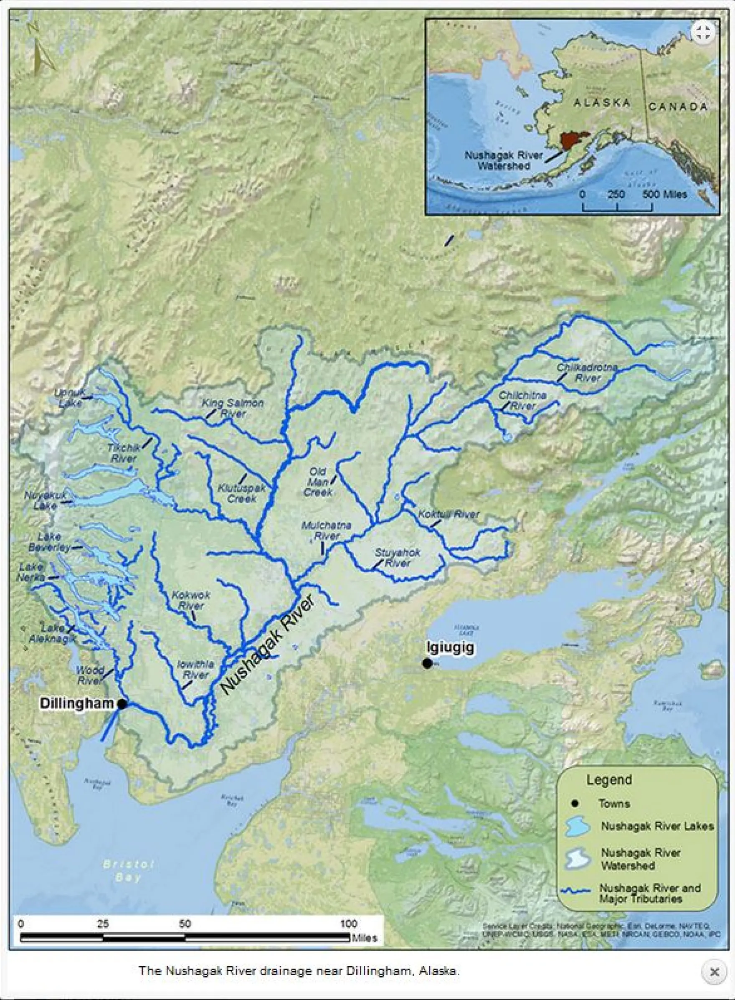

{fig-alt="Map of the Nushagak River watershed in southwest Alaska, showing the river and its tributaries including the Mulchatna and Nuyakuk rivers, and the communities of the region." width="60%"}

## Overview

This document synthesizes existing water quality data for the Nushagak River watershed (HUC6: 190303) in southwestern Alaska. The watershed supports one of the world's most significant wild salmon fisheries and is central to the cultural and subsistence economies of communities in the region including Ekwok, New Koliganek, New Stuyahok, Dillingham, and others.

The analysis aggregates publicly available monitoring data from the EPA Water Quality Portal (WQP) and USGS National Water Information System (NWIS), supplemented by regulatory and scientific literature. The goal is to establish an understanding of existing water quality conditions across the Nushagak drainage and to identify data gaps where new collaborative monitoring efforts could provide the greatest value.

## Structure

The document is organized in three parts:

**Part I** assembles existing data sources, maps monitoring station coverage, and catalogs what water quality parameters have been measured historically.

**Part II** synthesizes key physical, chemical, and biological parameters to characterize baseline conditions: temperature, pH, dissolved oxygen, metals, nutrients, and their relevance to salmon ecology.

**Part III** contextualizes this baseline within the RFP's two core goals: establishing continuous monitoring efforts and enhancing data management systems for the participating tribes.

## Scope and Limitations

This synthesis covers all four HUC8 sub-basins of the Nushagak drainage:

- **19030301** - Upper Nushagak River
- **19030302** - Mulchatna River
- **19030303** - Lower Nushagak River
- **19030304** - Wood River

(See <https://water.usgs.gov/themes/hydrologic-units/> for visual details).

All data presented derives from public repositories (WQP, NWIS) and published literature. Data completeness varies by location and parameter; gaps are noted throughout. This analysis is current as of March 2024 for WQP/NWIS data.

**Prepared**: October 2026\
**Data current through**: March 2024

*AI Disclosure: We used Posit Assistant (Claude Haiku 4.5 and Qwen3 30B) in RStudio to aid in debugging, deployment, and reproducibility of this web report. Content related to watershed monitoring plans and assessment of historic water quality data was drafted by Benjamin Meyer.*
